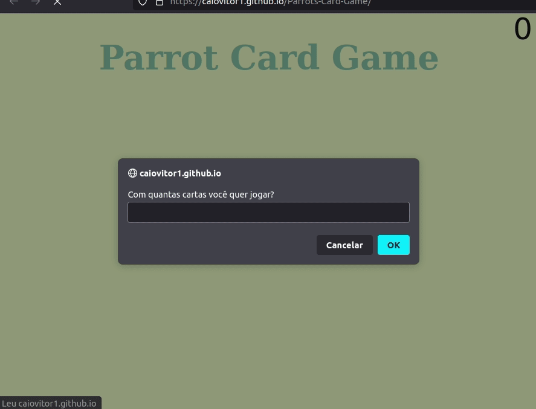

  

# ParrotsCardGame

    
<a href='https://caiovitor1.github.io/Parrots-Card-Game/'><button>  Teste aqui!</button></a> <br 

# Tabela de Conteúdos

* [Sobre](#sobre)
* [Tecnologias](#tecnologias)
* [Pré-Requisitos](#pre-requisitos)

# Sobre
<h3> Implementação do jogo Parrot Card Game, um jogo da memória temático com aleatoridade, efeitos e transição, responsividade e papagaios dançantes!
</h3>
 <h3>Esse jogo foi desenvolvido sem nenhuma biblioteca para implementar este projeto (jquery, lodash, react, etc), nem outras linguagens que compilem para JS (TypeScript, ELM, etc), somente JavaScript puro!!</h3>

# Tecnologias

 

 

         
  

# Made with love by <a href='https://www.linkedin.com/in/caiovitor33/'> Caio Vitor </a>

    
